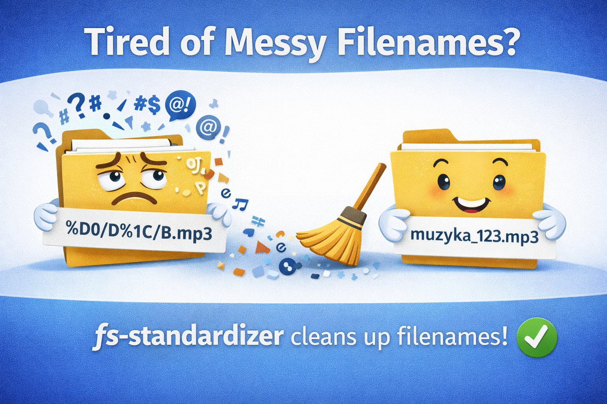

# fs-standardizer

<p align="center">
  
</p>

## The Problem

When you download files from the internet — music, books, movies, documents — they often come with messy, inconsistent filenames:

- **Encoding issues** — Cyrillic, Chinese, or other non-Latin characters become unreadable garbled text on different systems
- **Sync conflicts** — Slightly different filenames (e.g., due to case changes or special characters) cause duplicate files or overwrite each other during rsync, Dropbox, Google Drive, or NAS synchronization
- **Special characters** — Spaces, parentheses, quotes, and emojis break command-line tools and scripts
- **Inconsistent formatting** — Some files use dashes, others use underscores, some have all-lowercase names

## The Solution

**fs-standardizer** automatically standardizes filenames to ensure:

- ✅ Only safe ASCII characters (Latin letters, numbers, underscores)
- ✅ Consistent naming convention
- ✅ Cross-platform compatibility
- ✅ Safe synchronization across different systems

### Features

- 🔤 **Transliteration** — Converts Cyrillic (Russian, etc.) to Latin (e.g., "Привет" → "privet")
- 🧹 **Cleanup** — Removes or replaces special characters, spaces, emojis
- ⚙️ **Configurable** — Customize renaming rules via `config.toml`
- 👀 **Preview mode** — See changes before applying with `-f` flag

## Installation

```bash
cargo install fs-standardizer
```

Or build from source:

```bash
git clone https://github.com/yourusername/fs-standardizer.git
cd fs-standardizer
cargo build --release
```

## Quick Start

```bash
# Scan current directory
fs-standardizer .

# Use custom config
fs-standardizer -c config.toml

# Recursive scan with verbose output
fs-standardizer -c config.toml -v -r ~/Downloads/media

# Preview mode (don't actually rename)
fs-standardizer -c config.toml -f -v -r ~/Downloads/media
```

### CLI Options

| Flag | Description |
|------|-------------|
| `-c` | Path to configuration file (default: `config.toml`) |
| `-r` | Scan directories recursively |
| `-v` | Show old and new filenames |
| `-f` | Preview mode — don't actually rename files |

## Configuration

Edit `config.toml` to customize renaming rules:

```toml
[[rules]]
pattern = "[-\\(\\)\\&\\,\\s]"
replacement = "_"

[[rules]]
pattern = "PDF"
replacement = "pdf"
```

### Regex Patterns

The config uses Rust regex syntax. Common patterns:

- `\d` — digits (0-9)
- `\w` — word characters (a-z, A-Z, 0-9, _)
- `\s` — whitespace
- `*` — 0 or more repetitions
- `+` — 1 or more repetitions

## Architecture

```
┌─────────────────────────────────────────────┐
│              main.rs (CLI)                   │
│         Argument parsing & setup             │
└─────────────────┬───────────────────────────┘
                  │
                  ▼
┌─────────────────────────────────────────────┐
│              usecases/                       │
│   Business logic (rename, transliterate)     │
└─────────────────┬───────────────────────────┘
                  │
                  ▼
┌─────────────────────────────────────────────┐
│              ports/                          │
│        Interfaces (FileSystem, Config)       │
└─────────────────┬───────────────────────────┘
                  │
                  ▼
┌─────────────────────────────────────────────┐
│              adapters/                       │
│      Implementations (FsAdapter, etc.)      │
└─────────────────────────────────────────────┘
```

Built with 🦀 **Rust** — fast, safe, and reliable.

---

<!-- <p align="center">
  <a href="https://www.buymeacoffee.com/yourusername">
    
  </a>
</p> -->

<p align="center">
  <a href="https://tonviewer.com/UQCcbp-mue-7HTjDNQ_ZrKtg-tUxIFu817APmItjXasiBGP3">
    
  </a>
</p>

<p align="center">
  If this tool helps you, consider buying me a coffee! ☕
</p>
